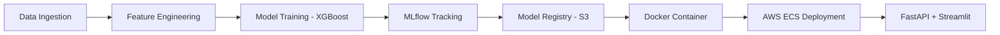

```markdown
<div align="center">

# 👋 Hi, I'm Ayush Kumar

**Data Scientist & Machine Learning Engineer**

Building reliable AI systems | Deep Learning | GenAI | MLOps

[](https://linkedin.com/in/ayushsyntax)
[](https://kaggle.com/ayushsyntax)
[](mailto:your.email@example.com)


</div>

---

## 🚀 About Me

```python
class DataScientist:
    def __init__(self):
        self.name = "Ayush Kumar"
        self.role = "ML Engineer & Data Scientist"
        self.education = "B.Tech in AI & Data Science"
        self.location = "Delhi, India"
        
    def current_focus(self):
        return [
            "Building agentic AI systems with LangGraph",
            "Production ML pipelines with MLOps",
            "Deep learning from first principles",
            "RAG systems and LLM orchestration"
        ]
    
    def philosophy(self):
        return "Build from scratch. Understand deeply. Deploy reliably."
```

I work on machine learning systems with focus on **reliability**, **explainability**, and **real-world deployment**. I learn by building from first principles, understanding failure modes, and iterating towards production-ready solutions.

---

## 🛠️ Tech Stack

<div align="center">

### Languages & Frameworks


### MLOps & Deployment


### GenAI & LLMs


### Data & Databases


</div>

---

## 📂 Featured Projects

### 🤖 [Agentic Research Assistant (ARA)](https://github.com/ayushsyntax/Agentic-Research-Assistant)

> Production-grade agentic AI with LangGraph | Tool-calling | RAG | Full Observability

**What makes it different:**
- 🧠 LLM decides when to use tools (web search, news, PDF retrieval)
- 💾 Persistent memory across sessions with LangGraph checkpointers
- 🔍 Full observability via LangSmith (traces, latency, token usage)
- 🧵 Thread-scoped vector stores for isolated research contexts
- ⚡ Low-latency Groq Llama 3.3 backend with automatic fallback

**Tech:** `LangGraph` · `LangChain` · `ChromaDB` · `SQLite` · `Streamlit` · `LangSmith` · `FastAPI`

```bash
# Quick Start
git clone https://github.com/ayushsyntax/Agentic-Research-Assistant
cd Agentic-Research-Assistant
docker-compose up
```

---

### 🏠 [End-to-End ML System: Housing Price Prediction](https://github.com/ayushsyntax/Regression_ML-End-to-End)

> Complete production pipeline | MLOps | AWS Deployment | CI/CD

**Architecture:**


**Key Features:**
- ⏰ Proper time-series validation (2016-2023 chronological splits)
- 🔧 Unified ETL pipeline (zero train-serve skew)
- 📊 Bayesian hyperparameter tuning with Optuna
- 🚀 Docker + ECS Fargate microservices
- 🔄 GitHub Actions CI/CD with automated testing

**Tech:** `XGBoost` · `Optuna` · `MLflow` · `Docker` · `AWS (ECS, S3, ALB)` · `FastAPI`

---

### 🧬 [GPT from Scratch in PyTorch](https://github.com/ayushsyntax/GPT-from-Scratch-in-PyTorch)

> Decoder-only Transformer built from first principles | No pre-built components

**Implementation Details:**
- 6-layer decoder-only architecture (GPT-2 style)
- Custom multi-head self-attention with causal masking
- Learned positional embeddings
- Character-level tokenizer (built from scratch)
- Trained on Shakespeare's complete works (~1.1M characters)

**Results:**
```
Perplexity: 3.02
Accuracy: 64.9%
Training: ~2 hours on single GPU
```

**Tech:** `PyTorch` · `NumPy` · `Gradio`

🎯 **[Try Live Demo](https://huggingface.co/spaces/ayushsyntax/shakespeare-gpt)**

---

### 🔄 [Reasona: Self-Correcting RAG](https://github.com/ayushsyntax/Reasona)

> Adaptive RAG system using HyDE + SEAL architecture

**How it learns:**
1. **HyDE Module:** Generates hypothetical answer → retrieves better context
2. **RAG Pipeline:** Generates final answer using retrieved context
3. **Critic Agent:** Evaluates answer quality
4. **SEAL Loop:** If incorrect → creates improved Q&A pairs → updates vector DB

**Tech:** `LangChain` · `ChromaDB` · `Ollama` · `FastAPI` · `Streamlit`

---

## 📊 GitHub Stats

<div align="center">


</div>

<div align="center">

[](https://git.io/streak-stats)

</div>

---

## 🏆 Achievements

| Achievement | Details |
|------------|---------|
| 🥇 **Kaggle Competition** | Top 9% in Playground Series (Binary Classification) |
| 🏅 **NexHack 2025** | Top 20 Finalists from 115 teams nationwide |
| 📜 **Columbia University** | Machine Learning I Certification (2025) |
| 📜 **IIT Bombay** | Advanced Python & C++ Certifications (2025) |

---

## 💼 Experience

### **Pickl.AI** — Summer Intern (Jul-Aug 2025)
- Built binary rainfall prediction system using XGBoost with stratified cross-validation
- Achieved **89+ ROC AUC** on imbalanced dataset through feature engineering
- Deployed end-to-end ML pipeline from data ingestion to model serving

### **GirlScript Summer of Code** — Open Source Contributor (Oct 2024)
- Contributed to multiple Python ML projects via Git workflows and code reviews

### **AppSquadz** — Data Analysis Intern (Jul-Aug 2024)
- Conducted EDA on credit card transactions using Pandas, Seaborn, Matplotlib

---

## 📚 Learning Philosophy

```yaml
Approach:
  - Build from scratch before using libraries
  - Understand failure modes, not just accuracy metrics
  - Production mindset: version control, testing, monitoring
  - Learn by iterating, not by reading alone

Current Focus:
  - Transformer internals and attention mechanisms
  - Multi-agent systems with LangGraph
  - Production ML: reproducibility, observability, safety
  - AI alignment and adversarial robustness
```

> *"I prefer to build and experiment when learning, rather than treating models as black boxes."*

---

## 📫 Let's Connect

<div align="center">

[](https://linkedin.com/in/ayushsyntax)
[](https://kaggle.com/ayushsyntax)
[](https://x.com/AyushSyntax)
[](mailto:your.email@example.com)

</div>

---

<div align="center">

### 💡 Currently Building

🔨 Multi-agent systems for research automation  
🧪 Experimenting with chain-of-thought prompting strategies  
📖 Contributing to open-source ML projects  

**Open to collaborate on production ML, GenAI, and MLOps projects**

</div>

---

<div align="center">

**Building slowly. Understanding deeply. Deploying reliably.**


⭐ *If you find my work helpful, consider starring the repos!*

</div>
```

